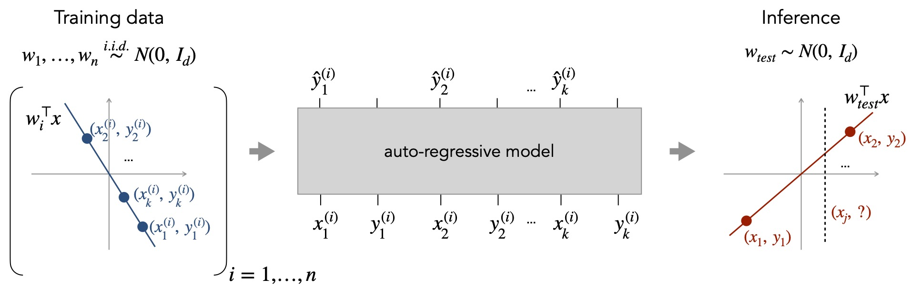

This repository contains the code and models for our paper:

**What Can Transformers Learn In-Context? A Case Study of Simple Function Classes** <br>
*Shivam Garg\*, Dimitris Tsipras\*, Percy Liang, Gregory Valiant* <br>
Paper: http://arxiv.org/abs/2208.01066 <br><br>



```bibtex
    @InProceedings{garg2022what,
        title={What Can Transformers Learn In-Context? A Case Study of Simple Function Classes},
        author={Shivam Garg and Dimitris Tsipras and Percy Liang and Gregory Valiant},
        year={2022},
        booktitle={arXiv preprint}
    }
```

## Getting started
You can start by cloning our repository and following the steps below.

1. Install the dependencies for our code using Conda. You may need to adjust the environment YAML file depending on your setup.

    ```
    conda env create -f environment.yml
    conda activate in-context-learning
    ```

2. Download [model checkpoints](https://github.com/dtsip/in-context-learning/releases/download/initial/models.zip) and extract them in the current directory.

    ```
    wget https://github.com/dtsip/in-context-learning/releases/download/initial/models.zip
    unzip models.zip
    ```

3. [Optional] If you plan to train, populate `conf/wandb.yaml` with you wandb info.

That's it! You can now explore our pre-trained models or train your own. The key entry points
are as follows (starting from `src`):
- The `eval.ipynb` notebook contains code to load our own pre-trained models, plot the pre-computed metrics, and evaluate them on new data.
- `train.py` takes as argument a configuration yaml from `conf` and trains the corresponding model. You can try `python train.py --config conf/toy.yaml` for a quick training run.

# Maintainers
* [Shivam Garg](https://cs.stanford.edu/~shivamg/)
* [Dimitris Tsipras](https://dtsipras.com/)
